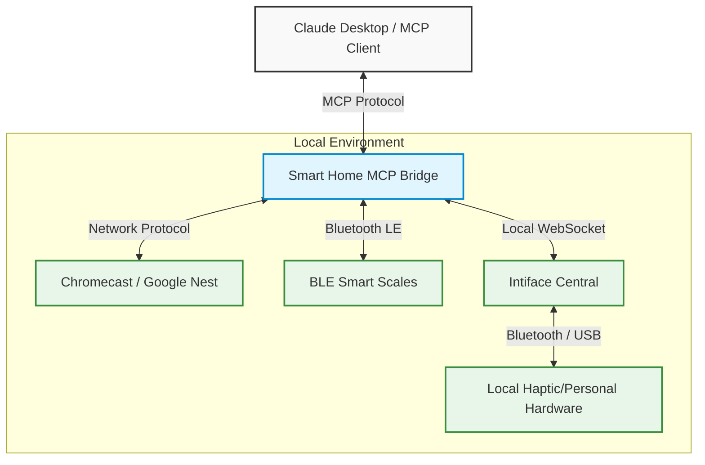

# Smart Home MCP Bridge

A local-first Model Context Protocol (MCP) bridge for integrating personal devices, smart home automation, and localized haptic hardware with Claude Desktop.

[](https://www.python.org/downloads/)
[](https://modelcontextprotocol.io/)
[](https://claude.ai/)
[]()
[](https://opensource.org/licenses/MIT)
[]()

> A bridge tool designed for authorized, localized control of network-attached devices, BLE smart equipment, and personal hardware via Anthropic's MCP.

## ⚠️ Responsible Use & Safety Notice

This project is intended **exclusively** for lawful, consent-based, and authorized personal use. The local-first architecture ensures that control remains within your immediate network environment.

- **Authorized Control Only:** You must only control devices you own or have explicit authorization to operate.
- **No Malicious Use:** This project must not be used for harassment, coercion, surveillance, non-consensual control, deception, or unsafe automation.
- **Local Deployment:** This MCP server is designed to be run locally. It is not intended for public deployment. Do not expose this service to the public internet.
- **Supervision & Overrides:** Always ensure manual device overrides are accessible. Any safety-critical workflows should require human supervision and explicit consent.
- **Liability:** Users are solely responsible for compliance with applicable laws, platform terms of service, hardware safety guidelines, and obtaining required consent.

## 📖 Project Overview

**Smart Home MCP Bridge** is a local automation tool that connects AI assistants supporting the Model Context Protocol (MCP) to various network and BLE devices in your local environment.

**What it does:**
- Bridges Claude Desktop with Google Nest / Chromecast devices for local media playback control.
- Integrates with local BLE smart scales (Chipsea/OKOK protocol).
- Connects to compatible local haptic/personal hardware devices (via Intiface Central).

**What it does NOT do:**
- It is not a cloud service or remote-control platform.
- It does not bypass device security or platform restrictions.

## 🎯 Project Scope

This repository focuses on engineering, research, and local automation workflows. All integrations are designed under the assumption of a secure, trusted local area network. Any usage outside of a local, trusted environment, or any attempts to utilize this tool for non-consensual remote control, strictly falls outside the intended project scope.

## ✨ Features

| Area | What it provides | Status |
| :--- | :--- | :--- |
| **Media Control** | Find and control Google Nest / Chromecast devices (play, pause, volume, app launching). | Ready / Local-only |
| **BLE Integrations** | Read weight metrics from OKOK/Chipsea compatible smart scales. | Experimental / Local-only |
| **Personal Hardware** | Local haptic/personal hardware automation via Intiface Central. | Experimental / Safety-critical |
| **Safety Governance** | Integrated safety governor with heat tracking for haptic devices. | Ready / Safety-critical |

## 🏗 Architecture



## 🛠 Installation

### Requirements
- **Python:** 3.10+
- **Media Control:** Google Nest or Chromecast on the local network.
- **BLE Devices:** BLE smart scale compatible with OKOK International app (Chipsea chip).
- **Personal Hardware:** Intiface Central running on port 12345.

### Environment Setup
Install the necessary dependencies using pip:
```bash
pip install mcp buttplug python-dotenv pychromecast bleak yt-dlp
```
*Note: Alternatively, you can use `pip install -e ".[dev]"` from `pyproject.toml` if available.*

### Claude Desktop Configuration
To enable the MCP server in Claude Desktop, configure your `claude_desktop_config.json` as follows:
```json
{
  "mcpServers": {
    "signal-bridge": {
      "command": "python",
      "args": ["C:\\path\\to\\smart-home-bridge\\signal_bridge_mcp.py"]
    },
    "smart-home": {
      "command": "python",
      "args": ["C:\\path\\to\\smart-home-bridge\\smart_home_mcp.py"]
    }
  }
}
```
*Note: Ensure paths are absolute. On Windows, use double backslashes (`\\`).*

## 🎮 Usage & Available Tools

These tools are exposed to the MCP client for authorized local workflows.

### Smart Home / Media Tools
| Tool | Description |
| :--- | :--- |
| `cast_list_devices` | Find all Chromecasts on the local network. |
| `cast_play_youtube` | Search and play a video on Chromecast. |
| `cast_pause` | Pause playback on Chromecast. |
| `cast_resume` | Resume playback on Chromecast. |
| `cast_stop` | Stop playback and quit the app. |
| `cast_set_volume` | Set volume (0.0 to 1.0) on Chromecast. |
| `cast_open_app` | Open an app (YouTube, Netflix, etc.) on Chromecast. |
| `scales_scan` | Find BLE scales in range. |
| `scales_read_weight` | Read weight from a smart scale in kg. |

### Local Personal Hardware Tools
| Tool | Description |
| :--- | :--- |
| `list_devices` | List all connected local haptic/personal hardware devices. |
| `vibrate` | Send a local haptic vibration command. |
| `rotate` | Send a local haptic rotation command. |
| `oscillate` | Send a local haptic oscillation command. |
| `pulse` | Perform a localized pulsing pattern. |
| `wave` | Perform a localized waving pattern. |
| `escalate` | Gradually increase haptic intensity. |
| `stop` | Stop all activity on a device. |
| `scan_devices` | Trigger a device scan in Intiface. |
| `safety_status` | View current heat level and session stats from the safety governor. |

## ⚠️ Limitations
- **Experimental Status:** Several hardware integrations are highly experimental and may behave unpredictably.
- **Local-Only Assumptions:** The bridge assumes a stable local network and direct device proximity. It does not handle routing.
- **Validation Required:** Users must independently validate model outputs and tool execution states.
- **Device Support:** Supported scales currently require the OKOK International app (Chipsea chip) broadcasting via BLE with prefix `0x02 0xF8`.

## 🔒 Security & Privacy
- **Do Not Expose:** Never expose this MCP server to the public internet. It operates without built-in authentication layers and relies entirely on local network security.
- **Trusted Environments Only:** Run this software exclusively on trusted local machines and secure local networks.
- **No Third-Party Access:** Do not grant device or media access to unauthorized third parties.
- **Secrets:** Do not store sensitive credentials in the repository. Use environment variables.
- **Consent:** Ensure you have appropriate authorization and consent for any devices connected to this bridge.

## 🤝 Contributing
Contributions are welcome for improving local integrations and stability. When contributing:
- Maintain and respect the responsible-use language intact.
- Do not add features that encourage abuse or non-consensual workflows.
- Preserve the clear local-first architecture and safe default behaviors.

## 📜 Credits & Upstream Compatibility
This project is built upon the open-source community's efforts.
- Built on [buttplug.io](https://buttplug.io) for local hardware integration and MCP by Anthropic.
- Contains upstream compatibility with [Signal Bridge](https://github.com/AletheiaVox/signal_bridge) by AletheiaVox, focused on providing localized device management in a safe, local environment.
